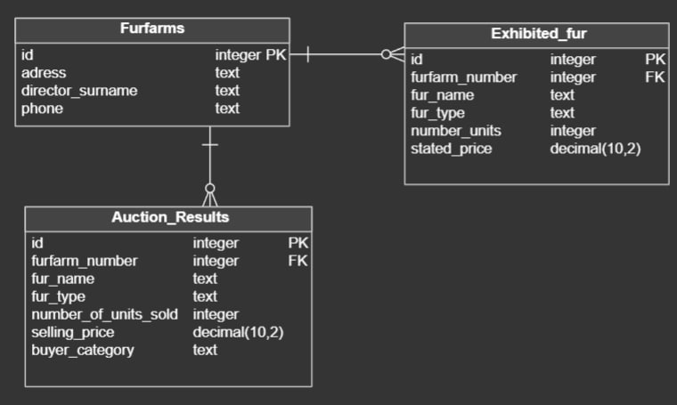

# Схема базы данных

## ER-диаграмма

## Таблицы

### Furfarms (зверофермы)

| Колонка | Тип | Ограничение |
| :--- | :--- | :--- |
| id | INTEGER | PRIMARY KEY |
| adress | TEXT | NOT NULL |
| director_surname | TEXT | NOT NULL |
| phone | TEXT | NOT NULL |

### Users (пользователи)

| Колонка | Тип | Ограничение |
| :--- | :--- | :--- |
| id | INTEGER | PRIMARY KEY |
| username | TEXT | NOT NULL UNIQUE |
| password | TEXT | NOT NULL |
| role | TEXT | CHECK (role IN ('admin', 'farm_user')) |
| farm_id | INTEGER | FOREIGN KEY REFERENCES Furfarms(id) |

### Exhibited_fur (выставленная пушнина)

| Колонка | Тип | Ограничение |
| :--- | :--- | :--- |
| id | INTEGER | PRIMARY KEY |
| furfarm_number | INTEGER | FOREIGN KEY REFERENCES Furfarms(id) |
| fur_name | TEXT | NOT NULL |
| fur_type | TEXT | NOT NULL |
| number_units | INTEGER | CHECK (number_units > 0) |
| stated_price | REAL | NOT NULL |

### Auction_Results (результаты аукциона)

| Колонка | Тип | Ограничение |
| :--- | :--- | :--- |
| id | INTEGER | PRIMARY KEY |
| furfarm_number | INTEGER | FOREIGN KEY REFERENCES Furfarms(id) |
| fur_name | TEXT | NOT NULL |
| fur_type | TEXT | NOT NULL |
| number_of_units_sold | INTEGER | CHECK (number_of_units_sold > 0) |
| selling_price | REAL | NOT NULL |
| buyer_category | TEXT | CHECK (buyer_category IN ('fur factory', 'studio', 'private individual')) |

## SQL-скрипт

Файл создания и заполнения БД: [FurAuction_create.sql](https://github.com/Cloudy680/tpmp-lab4-rep2/blob/main/data/FurAuction_create.sql)