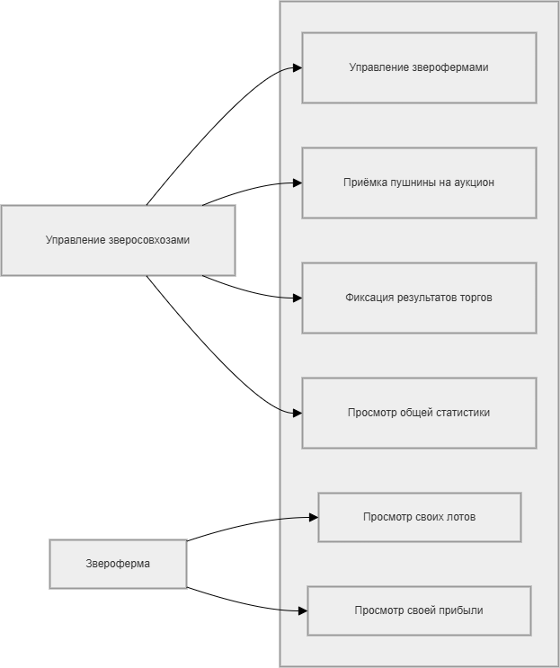

# Функциональные требования

## Диаграмма вариантов использования

### Акторы

| Актор | Описание |
| :--- | :--- |
| Управление зверосовхозами | Центральный администратор системы, имеет полный доступ ко всем данным и операциям |
| Звероферма | Ограниченный пользователь, имеющий доступ только к данным своей фермы |

### Варианты использования

| Вариант использования | Актор |
| :--- | :--- |
| Управление зверофермами | Управление зверосовхозами |
| Приёмка пушнины на аукцион | Управление зверосовхозами |
| Фиксация результатов торгов | Управление зверосовхозами |
| Просмотр общей статистики | Управление зверосовхозами |
| Просмотр своих лотов | Звероферма |
| Просмотр своей прибыли | Звероферма |

## Текстовый сценарий (для варианта использования «Фиксация результатов торгов»)

| Поле | Значение |
| :--- | :--- |
| **Название** | Фиксация результатов торгов |
| **Актор** | Управление зверосовхозами |
| **Предусловие** | Лот выставлен на аукцион (запись в таблице Exhibited_fur) |
| **Постусловие** | Добавлена запись в таблицу Auction_Results, количество единиц лота уменьшено |

**Основной поток:**
1. Администратор выбирает пункт меню «Фиксация результатов торгов».
2. Система запрашивает данные: ID фермы, название меха, сорт, количество проданных единиц, продажную цену, категорию покупателя.
3. Администратор вводит запрошенные данные.
4. Система проверяет, что количество продано ≤ количество заявлено в лоте.
5. Система сохраняет запись в таблицу Auction_Results.
6. Система уменьшает количество единиц в Exhibited_fur.
7. Система выводит сообщение: «Результат успешно зафиксирован».

**Альтернативный поток (ошибка):**
- Если количество продано > количество заявлено, система выводит сообщение «Ошибка: количество проданных единиц превышает заявленное» и возвращает к вводу данных.