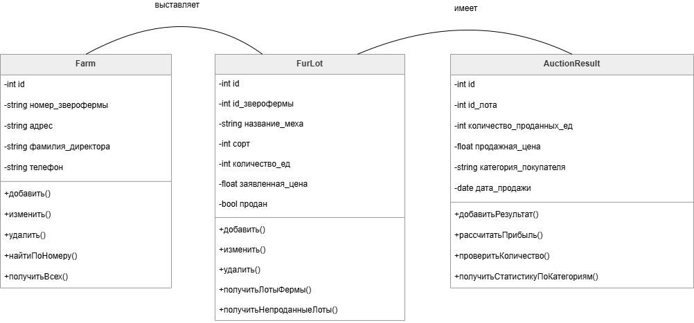
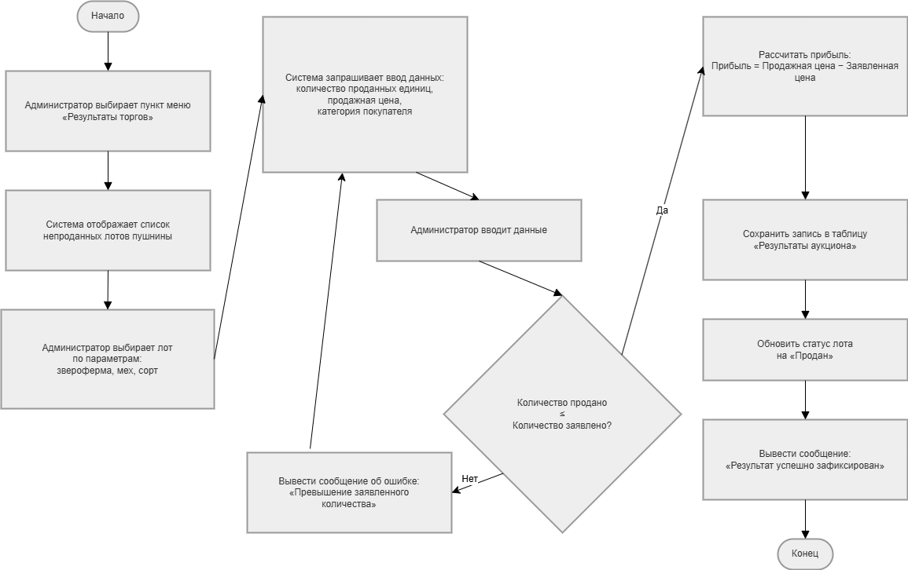
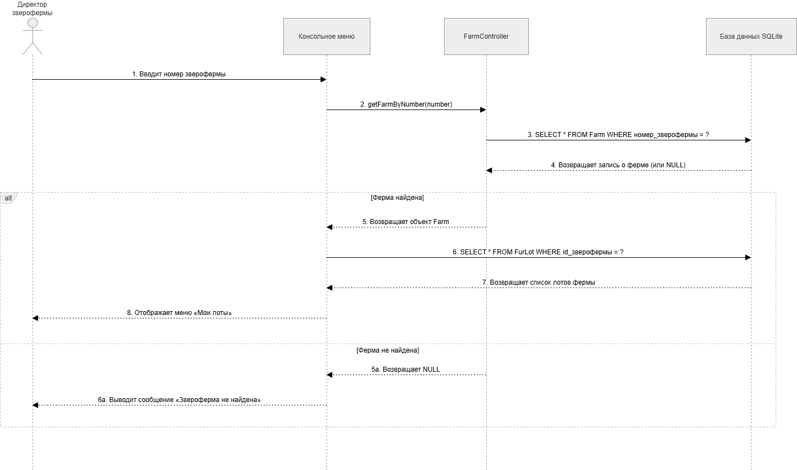
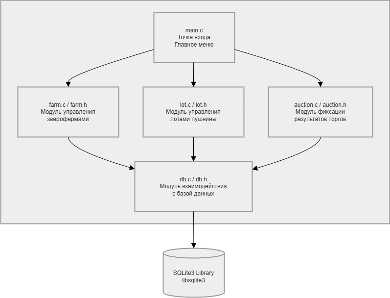

# Спецификация проекта

## Диаграмма классов

### Класс «Звероферма» (Farm)

**Атрибуты:** id, адрес, фамилия_директора, телефон

**Методы:** addFarm(), updateFarm(), deleteFarm(), getFarmById(), getAllFarms()

### Класс «Лот пушнины» (Lot)

**Атрибуты:** id, farmId, furName, furType, numberUnits, statedPrice

**Методы:** addLot(), updateLot(), deleteLot(), getLotById(), getLotsByFarm()

### Класс «Результат аукциона» (AuctionResult)

**Атрибуты:** id, farmId, furName, furType, soldUnits, sellingPrice, buyerCategory

**Методы:** addAuctionResult(), validateAuctionResult(), reportFarmWithHighestPrice(), reportByBuyerCategory(), reportProfitByFarm(), reportFarmsAboveAvgPrice(), reportFarmMaxProfit(), listFarmsLowProfit(), getFarmProfit()

## Диаграмма деятельности

**Описание алгоритма «Фиксация результатов торгов»:**
1. Администратор выбирает пункт меню
2. Система запрашивает данные о продаже
3. Администратор вводит данные
4. Проверка: количество продано ≤ количество заявлено
   - Если НЕТ → сообщение об ошибке, возврат к вводу
   - Если ДА → расчёт прибыли, сохранение в БД, обновление статуса лота
5. Вывод сообщения об успехе

## Диаграмма последовательности

**Процесс получения информации о лотах зверофермой:**

| Шаг | Отправитель | Получатель | Сообщение |
| :--- | :--- | :--- | :--- |
| 1 | Директор | Консольное меню | Вводит номер зверофермы |
| 2 | Консольное меню | FarmController | getFarmByNumber(number) |
| 3 | FarmController | БД SQLite | SELECT * FROM Farm WHERE id = ? |
| 4 | БД SQLite | FarmController | Возвращает запись |
| 5 | FarmController | Консольное меню | Возвращает объект Farm |
| 6 | Консольное меню | БД SQLite | SELECT * FROM Exhibited_fur WHERE furfarm_number = ? |
| 7 | БД SQLite | Консольное меню | Возвращает список лотов |
| 8 | Консольное меню | Директор | Отображает список лотов |

## Диаграмма компонентов

| Компонент | Файлы | Назначение |
| :--- | :--- | :--- |
| main | main.cpp | Точка входа, главное меню |
| Модуль аутентификации | Auth.cpp / Auth.h | Логин пользователя |
| Модуль управления фермами | Farm.cpp / Farm.h | CRUD ферм |
| Модуль управления лотами | Lot.cpp / Lot.h | CRUD лотов |
| Модуль аукциона | Auction.cpp / Auction.h | Фиксация результатов, отчёты |
| Модуль БД | Database.cpp / Database.h | Подключение к SQLite |
